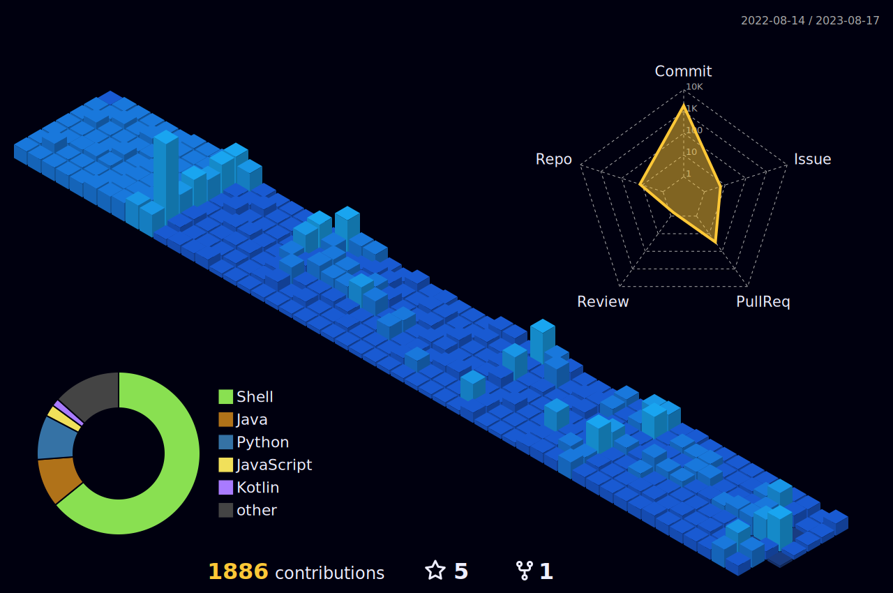

## 소개
안녕하세요! `우연`이라는 닉네임을 쓰는 백엔드 개발자 [박은우](https://dev-wooyeon.github.io/quiz-app/)입니다. 우연히 알게된 HTML로 "Hello, World!"를 출력했을 때부터 개발에 대한 매력을 느껴 하다보니 여기까지 왔습니다. 더 좋은 개발자로서 성장하기 위해 학습하고, 경험하고, 노력하고 있습니다.


## 경험
- Monolith : Backend Developer (Apr 2023 ~ now)
- Eximbay  : Software Developer (Dec 2019 ~ Mar 2023)

## 기술
[](https://skillicons.dev)

## 정보
- 블로그 : [Notion](https://notion-blog-ieunune.vercel.app)
- 이력서 : [Notion](https://ieunune.notion.site/1b27443f2ea08016b614ef5b59e8f1c0?pvs=4)
- 이메일 : une@kakao.com

## 🏆 코딩력 🏆 
- 통합 코딩력(2023.08.04~)

[](https://wakatime.com/@099dd627-fdab-4072-b87a-fa91c7a76d8d)

- 주간 코딩력(최근 7일)

<!--START_SECTION:waka-->

```txt
Java              8 hrs 43 mins   ███████████████████░░░░░░   76.12 %
Python            1 hr 38 mins    ███▓░░░░░░░░░░░░░░░░░░░░░   14.29 %
Other             26 mins         █░░░░░░░░░░░░░░░░░░░░░░░░   03.78 %
YAML              23 mins         █░░░░░░░░░░░░░░░░░░░░░░░░   03.38 %
Groovy            9 mins          ▒░░░░░░░░░░░░░░░░░░░░░░░░   01.40 %
```

<!--END_SECTION:waka-->

<!-- -->

## 커밋 농장
<a href="https://github.com/devxb/gitanimals">
  
</a>
