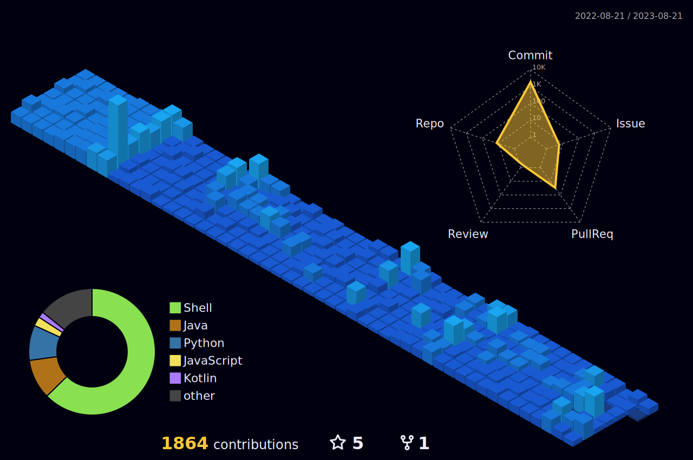

안녕하세요, 청렴결백한 논리주의자 [우연](https://dev-wooyeon.github.io/quiz-app/)입니다.  
저를 궁금해하실 줄 알고 [이력서](https://ieunune.notion.site/d836ecc9172144d4b39f185b89f16a62)랑 [블로그](https://notion-blog-ieunune.vercel.app)를 준비했습니다.  
제 [주인님](https://www.instagram.com/lovely_hiru_hari_s2/)도 보고 가세요.


📊 **실시간 트래킹 코딩타임: 23년 8월 4일 부터**  

[](https://wakatime.com/@099dd627-fdab-4072-b87a-fa91c7a76d8d)

📊 **주간 트래킹 코딩타임: 최근 7일간 통계**

<!--START_SECTION:waka-->

```txt
Java             27 hrs 36 mins  ████████████████▒░░░░░░░░   65.75 %
Python           8 hrs 46 mins   █████▒░░░░░░░░░░░░░░░░░░░   20.89 %
YAML             2 hrs 21 mins   █▒░░░░░░░░░░░░░░░░░░░░░░░   05.61 %
Gradle           1 hr 8 mins     ▓░░░░░░░░░░░░░░░░░░░░░░░░   02.73 %
Other            1 hr 4 mins     ▓░░░░░░░░░░░░░░░░░░░░░░░░   02.54 %
```

<!--END_SECTION:waka-->

<!-- -->
